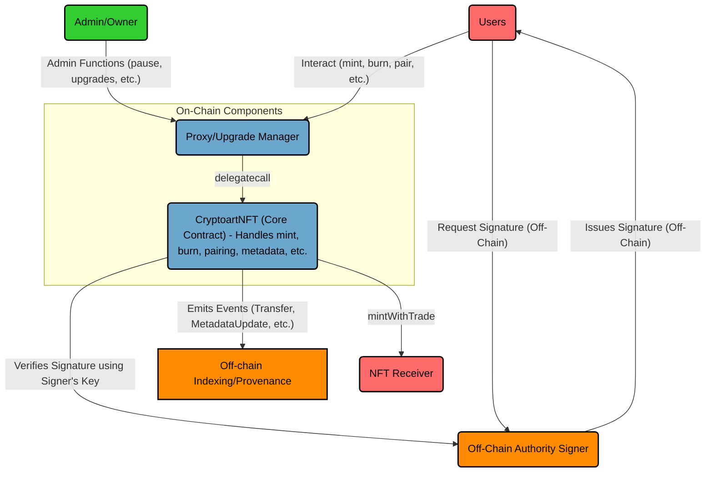

# Cryptoart NFT

## Table of Contents

1. [Project Overview](#1-project-overview)
2. [Scope Definition](#2-scope-definition) 
3. [Features Overview](#3-features-overview)
4. [Architecture & Core Mechanisms](#4-architecture--core-mechanisms)
5. [Actors & Roles](#5-actors--roles)
6. [Trust Assumptions & Centralization Risks](#6-trust-assumptions--centralization-risks)
7. [External Dependencies](#7-external-dependencies)
8. [Setup, Testing, Deployment & Upgrades](#8-setup-testing-deployment--upgrades)
9. [Known Issues](#9-known-issues)

---

## 1. Project Overview

The Cryptoart NFT project aims to create a unique NFT collection on the Base blockchain that bridges digital ownership with physical art pieces. The core concept revolves around "pairable" NFTs:

*   NFTs represent ownership of crypto-related art.
*   Holders can "pair" (redeem) their NFT to receive a physical, limited-edition art piece shipped by Cryptoart.com. This marks the NFT metadata as Redeemable = FALSE.
*   Holders can "unpair" (un-redeem) their NFT by destroying the physical piece's authentication mechanism (NFC sticker/QR code) and use an authorized process to reset its metadata to Redeemable = TRUE. This allows the holder to sell the NFT in a redeemable state, enabling future holders to pair it with the same physical numbered art piece. The process removes risks and authentication concerns normally associated with collector-to-collector shipment of physical art.
*   Holders may opt to sell their NFT while it's still paired. Since NFTs can only be paired with one numbered art piece, paired NFTs trade/function like traditional (non-redeemable) NFTs.
*   The collection utilizes scarcity mechanics, allowing users to burn or trade existing NFTs within the collection for potentially more desirable ones.
*   Owners can add "stories" to their NFTs, creating a permanent, on-chain provenance log via emitted events (IStory interface).

The primary smart contract, `CryptoartNFT.sol`, manages the minting, burning, ownership, metadata (including pairing status via IERC7160), royalties (ERC2981), and story inscriptions for the collection. Minting operations are primarily controlled via an off-chain voucher system, requiring signatures from a trusted `authoritySigner`.

The contracts are developed using Foundry and utilize OpenZeppelin's upgradeable contracts (`@openzeppelin-contracts-upgradeable-5.0.2`), deploying behind a proxy.

---

## 2. Scope Definition

The following files are in scope:

```
src/
├── CryptoartNFT.sol            # Main contract implementing ERC721 with extensions
├── interfaces
│   ├── IERC7160.sol            # Interface for multi-metadata extension
│   └── IStory.sol              # Interface for story functionality
└── libraries
    └── Error.sol               # Custom error definitions
```

### Primary Contract: CryptoartNFT.sol

This contract is the core implementation, inheriting from multiple OpenZeppelin contracts and implementing custom interfaces:
- Implements ERC721 with Enumerable, Royalty, and Burnable extensions
- Implements IERC7160 for metadata management
- Implements IERC4906 for metadata updates
- Implements IStory for story functionality
- Includes Ownable, Pausable, and ReentrancyGuard for security and control

---

## 3. Features Overview

- **Signature-Based Voucher System**: Ensures secure, authorized minting through cryptographically verified vouchers
- **Physical/Digital Pairing**: NFTs can be paired with physical art pieces and later unpaired if the physical art is destroyed
- **Story Functionality**: NFT owners can attach stories to enrich the context of their artwork.
- **Scarcity Mechanics**: Supports burning existing tokens to mint new, potentially more valuable tokens
- **Admin Controls**: Owner-managed features for royalties, pausing, and contract configuration



---

## 4. Architecture & Core Mechanisms

The system revolves around the `CryptoartNFT.sol` contract, which inherits these contracts:

*   **ERC721:** Base NFT standard (Enumerable, Burnable).
*   **ERC2981:** NFT Royalty Standard.
*   **IERC7160:** Multi-Metadata for managing pairing status.
*   **IStory:** Interface for adding creator/collector stories.
*   **OwnableUpgradeable:** Access control for administrative functions. (Openzeppelin)
*   **PausableUpgradeable:** Emergency stop mechanism. (Openzeppelin)
*   **NoncesUpgradeable:** Replay protection for signatures. (Openzeppelin)
*   **ReentrancyGuardTransientUpgradeable:** Protection against reentrancy attacks on specific functions. (Openzeppelin)

### Signature-Based Voucher Minting

*   Minting actions (`mint`, `claim`, `mintWithTrade`, `burnAndMint`) require a `MintValidationData` struct containing parameters like `recipient`, `tokenId`, `mintType`, `tokenPrice`, and a cryptographic `signature`.
*   This signature must be generated off-chain by the designated `authoritySigner` address.
*   The signature validates the mint parameters, including the initial metadata URIs (`TokenURISet`) for the specific token.
*   The contract verifies the signature against a hash of the parameters, the contract address, and a unique nonce for the recipient (`_validateSignature`, `_isValidSignature`). The nonce prevents replay attacks using the same signature.
*   Payment is handled within the mint functions, validating `msg.value` against `tokenPrice` and refunding excess ETH.

### Physical/Digital Pairing - NFT Pairing/Redemption (IERC7160)

*   This mechanism manages the "redeemable" status of the NFT, corresponding to whether a physical counterpart can be claimed.
*   Each token stores two URIs (`_tokenURIs` mapping): one for when redeemable (`Redeemable = TRUE`) and one for when not redeemable (`Redeemable = FALSE`).
*   The `_pinnedURIIndices` mapping stores which of the two URIs is currently active, controlled by the `_hasPinnedTokenURI` flag.
*   The `tokenURI` function returns the currently active URI based on the pinned index.
*   **Pairing (Redeeming Physical):** Handled off-chain by Cryptoart.com. The `Owner` can use `pinTokenURI(tokenId, 1)` to set the metadata to the "not redeemable" state (index 1).
*   **Unpairing (Destroying Physical):** The token owner calls `markAsRedeemable(tokenId, signature)`. This requires a signature from the `authoritySigner` (verified via `_validateUnpairAuthorization`) to authorize the state change back to "redeemable" (index 0). This can be an off-chain process where the user proves physical destruction to the authority, who then provides the signature.
*   Metadata updates emit `MetadataUpdate` (ERC4906) and `TokenUriPinned` events.

### Story Inscriptions (IStory)

*   Implements functions (`addCreatorStory`, `addStory`) allowing token owners to emit events containing story text/metadata.
*   Visibility toggling (`toggleStoryVisibility`) emits an event, interpreted off-chain.
*   Right now, story content is stored in event logs, not contract storage. This could potentially change though.

### Scarcity Mechanics

*   `mintWithTrade`: Allows minting a new token by providing a voucher and transferring a specified list of existing NFTs from the sender to the `nftReceiver` address.
*   `burnAndMint`: Allows minting a new token by providing a voucher and burning a specified list and count of existing NFTs owned by the sender.
* `totalSupply`: Limited total supply enforced against a set max supply. Both of these parameters can be adjusted by the contract owner. 

### Royalties (ERC2981)

*   Standard implementation using OpenZeppelin's `ERC721RoyaltyUpgradeable`.
*   Default royalty set during initialization, updatable by the `Owner`.
*   Token-specific royalties can also be set by the `Owner`.

### Upgradeability

*   The contract uses OpenZeppelin Upgradeable libraries (`@openzeppelin-contracts-upgradeable-5.0.2`).
*   It includes an `initializer` function and inherits `Initializable`.

---

## 5. Actors & Roles

*   **Proxy Admin:**
    *   Owns the ProxyAdmin contract, which controls upgrades to the `CryptoartNFT` proxy.
    *   Solely responsible for executing contract upgrades by updating the implementation address the proxy points to.
    *   Does not interact with the `CryptoartNFT` logic directly (e.g., no minting or metadata control).
*   **Contract Owner (`OwnableUpgradeable`):**
    *   Privileged administrator of the contract.
    *   Can pause/unpause the contract.
    *   Can withdraw all contract ETH balance.
    *   Can update critical parameters: `authoritySigner`, `nftReceiver`, default royalties, `baseURI`, `maxSupply`.
    *   Can update token metadata URIs directly (`updateMetadata`).
    *   Can pin token URIs (`pinTokenURI`).
    *   Can set token-specific royalties.
    *   Can transfer ownership.
    *   *Implicitly:* Controls the upgradeability mechanism via a ProxyAdmin or similar pattern.
*   **Authority Signer (`authoritySigner`):**
    *   A trusted off-chain entity (or key) responsible for signing messages (vouchers) that authorize minting operations.
    *   Also signs messages required for users to "unpair" their NFT (`markAsRedeemable`).
    *   Does *not* have direct on-chain execution privileges but holds gatekeeping power over token creation and state changes related to pairing.
    *   Address is configurable by the `Owner`.
*   **NFT Receiver (`nftReceiver`):**
    *   An address designated to receive NFTs that are traded in during `mintWithTrade` operations.
    *   Configurable by the `Owner`. Assumed to be a controlled wallet/contract.
*   **Users / Collectors:**
    *   Interact with the contract to mint (with a valid voucher and payment), claim, burn, or trade NFTs.
    *   Can call `markAsRedeemable` (with a valid signature from the `authoritySigner`) to change the NFT state after physical destruction.
    *   Can add stories to owned NFTs (`addCreatorStory`, `addStory`).
    *   Can toggle visibility of stories (`toggleStoryVisibility`).
    *   Standard ERC721 interactions (transfer, approve).

---

## 6. Trust Assumptions & Centralization Risks

This system has significant centralization aspects that auditors should be aware of:

1.  **Owner:** The `Owner` role holds extensive power. A compromised or malicious Owner can:
    *   Steal all funds via `withdraw()`.
    *   Halt all operations via `pause()`.
    *   Change the `authoritySigner` to themselves or a colluding address, enabling unauthorized minting/unpairing.
    *   Change the `nftReceiver` to steal traded NFTs.
    *   Modify royalties arbitrarily.
    *   Brick functionality by setting invalid parameters.
    *   Perform contract upgrades (implicitly) to introduce arbitrary logic changes.
    *   **Assumption:** The `Owner` address/entity is highly trusted and secured.
2.  **Authority Signer:** Control over the `authoritySigner` key(s) is paramount. A compromised or malicious signer can:
    *   Authorize the minting of arbitrary NFTs up to `maxSupply`, potentially devaluing the collection or bypassing payment logic (if `tokenPrice` is manipulated in the signed message).
    *   Authorize the "unpairing" (`markAsRedeemable`) of any NFT, breaking the link between digital state and physical reality.
    *   **Assumption:** The `authoritySigner` key(s) are securely managed off-chain, and the signing process is robust against manipulation and unauthorized access. The off-chain service generating these signatures can be assumed to be secure and reliable.
3.  **Off-Chain Voucher/Signature Generation:** The entire minting and unpairing process relies on an off-chain system generating signatures. The security, availability, and correctness of this off-chain system are critical but *out of scope* for this smart contract audit.
4.  **Upgradeability:** The mechanism used for upgrades (e.g., ProxyAdmin owner) introduces trust assumptions regarding who can perform upgrades and the security of that process.
5.  **NFT Receiver:** Less critical, but the destination for traded NFTs relies on the `Owner` setting a correct and secure address.

---

## 7. External Dependencies

*   **@openzeppelin/contracts-upgradeable v5.0.2:**
    *   `access/OwnableUpgradeable.sol`
    *   `token/ERC721/extensions/ERC721BurnableUpgradeable.sol`
    *   `token/ERC721/extensions/ERC721EnumerableUpgradeable.sol`
    *   `token/ERC721/extensions/ERC721RoyaltyUpgradeable.sol`
    *   `utils/NoncesUpgradeable.sol`
    *   `utils/PausableUpgradeable.sol`
    *   `utils/ReentrancyGuardTransientUpgradeable.sol`
*   **@openzeppelin/contracts v5.0.2:** 
    *   `interfaces/IERC4906.sol`
    *   `utils/cryptography/ECDSA.sol`
    *   `utils/cryptography/MessageHashUtils.sol`
    *   `utils/Strings.sol`

**Assumptions about Dependencies:**
*   The OpenZeppelin contracts are assumed to be secure and behave as documented for version 5.0.2.
*   Standard cryptographic primitives (`ECDSA`, `keccak256`) are assumed to be secure.

---

## 8. Setup, Testing, Deployment & Upgrades

The project uses Foundry for development and testing.

### Environment Setup

1. **Install Foundry**:
```bash
curl -L https://foundry.paradigm.xyz | bash
foundryup
```

2. **Clone the repository**:
```bash
git clone https://github.com/cryptoartcom/cryptoart-smart-contracts.git
cd cryptoart-smart-contracts
```

3. **Install dependencies**:
```bash
forge install
```

4. **Compile contracts**:
```bash
forge build
```

5. **Set Up Environment Variables**:
    - Copy the example `.env` file:
    
    ```bash
    cp .example.env .env
    ```
    
    - The .env.example file includes preset Anvil keys and addresses for local testing (e.g., `PROXY_ADMIN_OWNER_PRIVATE_KEY=0xac0974bec...`). These are safe to use as-is for local testing with Anvil and do not need to be changed. Example `.env` content:
    
    ```env
    # --- RPC Endpoints ---
    SEPOLIA_URL=
    BASE_SEPOLIA_URL=
    LOCAL_NODE_URL=http://127.0.0.1:8545
    
    # --- Etherscan API Keys ---
    SEPOLIA_API_KEY=
    BASE_SEPOLIA_API_KEY=
    
    # --- Private Keys ---
    PROXY_ADMIN_OWNER_PRIVATE_KEY=0xac0974bec39a17e36ba4a6b4d238ff944bacb478cbed5efcae784d7bf4f2ff80    # Example Anvil Key 0
    OWNER_PRIVATE_KEY=0x59c6995e998f97a5a0044966f0945389dc9e86dae88c7a8412f4603b6b78690d                # Example Anvil Key 1
    AUTHORITY_SIGNER_PRIVATE_KEY=0x5de4111afa1a4b94908f83103eb1f1706367c2e68ca870fc3fb9a804cdab365a     # Example Anvil Key 2
    NFT_RECEIVER_PRIVATE_KEY=0x7c852118294e51e653712a81e05800f419141751be58f605c371e15141b007a6         # Example Anvil Key 3
    MINTER_PRIVATE_KEY=0x47e179ec197488593b187f80a00eb0da91f1b9d0b13f8733639f19c30a34926a               # Example Anvil Key 4
    
    # --- Public Keys ---
    PROXY_ADMIN_OWNER=0xf39Fd6e51aad88F6F4ce6aB8827279cffFb92266    # Example Anvil Addr 0
    OWNER_ADDRESS=0x70997970C51812dc3A010C7d01b50e0d17dc79C8        # Example Anvil Addr 1
    AUTHORITY_SIGNER=0x3C44CdDdB6a900fa2b585dd299e03d12FA4293BC     # Example Anvil Addr 2
    NFT_RECEIVER=0x90F79bf6EB2c4f870365E785982E1f101E93b906         # Example Anvil Addr 3
    MINTER_ADDRESS=0x15d34AAf54267DB7D7c367839AAf71A00a2C6A65       # Example Anvil Addr 4
    
    # --- Deployment Vars ---
    MAX_SUPPLY=10000
    BASE_URI="ipfs://anvil_test_v1/"
    
    # --- Upgrade Vars (Set later) ---
    TRANSPARENT_PROXY_ADDRESS=
    IMPLEMENTATION_ADDRESS=
    ```

### Running Tests

```bash
# Run all tests
forge test

# Or to run only the tests in each folder:
forge test --match-path "test/fuzz/*"
forge test --match-path "test/integration/*"
forge test --match-path "test/unit/*"

# Run tests with gas reporting
forge test --gas-report

# Run tests with verbosity
forge test -vvv

# Check test coverage
forge coverage --ir-minimum

# To run the upgrade test, clean the cache first and run with the `--ffi` flag
forge cache clean
forge clean
forge build
forge test --match-contract UpgradesTest --ffi
```

### Test Coverage

Our test suite includes:
- Unit tests for all contract functions
- Integration tests for key user workflows
- Fuzz tests for mint, burn, and metadata operations

```
test/
├── CryptoartNFTBase.t.sol
├── fuzz
│   ├── BurnFuzzTest.t.sol
│   ├── MetadataFuzzTest.t.sol
│   └── MintFuzzTest.t.sol
├── helpers
│   ├── SigningUtils.sol
│   ├── TestAssertions.sol
│   └── TestFixtures.sol
├── integration
│   ├── FullWorkFlow.t.sol
│   ├── LifecycleTest.t.sol
│   └── RoyaltyMetadataTest.t.sol
├── unit
│   ├── Admin.t.sol
│   ├── BurnOperationsTest.t.sol
│   ├── Initialization.t.sol
│   ├── MetadataManagementTest.t.sol
│   ├── MintOperationsTest.t.sol
│   └── StoryFeaturesTest.t.sol
└── upgrade
    ├── CryptoartNFTMockUpgrade.sol
    ├── MockSigningUtils.sol
    └── Upgrades.t.sol
```

### Deployment and Upgrading via the Makefile to Anvil or Sepolia Testnet

The Makefile simplifies key tasks to streamline long commands in the CLI. 

Run `make help` for instructions on how to use the makefile.

**1. Starting a Local Anvil Node**

Spin up a local Anvil node for testing:

```bash
make anvil
```
- This starts Anvil with a mnemonic for reproducible accounts and a 1-second block time.

**2. Deploying Contracts**

Deploy the contracts to the specified network (default is localhost):

```bash
make deploy [NETWORK=<network>]
```
* For localhost: `make deploy`
* For Sepolia: `make deploy NETWORK=sepolia`
* Ensure your `.env` file has the necessary variables set for the target network (e.g., `SEPOLIA_URL`, `PROXY_ADMIN_OWNER_PRIVATE_KEY`).
* Note the deployed proxy address from the output (e.g., `0xYourProxyAddress`).

**3. Upgrading the Contract** 

To upgrade the contract to a new implementation (e.g., `CryptoartNFTMockUpgrade.sol`):

* Ensure `TRANSPARENT_PROXY_ADDRESS` is set in `.env` from the deployment step.

    ```env
    TRANSPARENT_PROXY_ADDRESS=0xYourProxyAddress
    ```
    
* Run:     
    
    ```bash
    make upgradeCryptoartNFTMock [NETWORK=<network>]
    ```
    - For localhost: `make upgradeCryptoartNFTMock`
    - For Sepolia: `make upgradeCryptoartNFTMock NETWORK=sepolia`
    
* The script automatically deploys the new implementation and upgrades the proxy to point to it.
* If the new implementation requires initialization, ensure `INIT_DATA` is set appropriately in the Makefile (e.g., `cast calldata "initializeV2()"`).
  
**4. Minting an NFT**

Mint an NFT on a local node:
- Make sure `TRANSPARENT_PROXY_ADDRESS` is set in `.env` from deployment.
- Run:

  ```bash
  make mintNFT TOKENID=<some token ID> PRICE=<some token price> [NETWORK=sepolia]
  ```
  
  - Examples:
    - For localhost: `make mintNFT TOKENID=1 PRICE=100000000000000000` (0.1 ETH)
    - For Sepolia: `make mintNFT TOKENID=1 PRICE=100000000000000000 NETWORK=sepolia`

- Optional parameters (e.g., for specific mint types):

  ```bash
  make mintNFT TOKENID=2 PRICE=0 MINTTYPE=1 URI_REDEEMABLE="ipfs://redeemable_uri" URI_NOT_REDEEMABLE="ipfs://not_redeemable_uri"
  ```

**Verifying on Etherscan (for Sepolia Deployments)**
* After deployment or upgrade on Sepolia, the script will output the proxy and implementation addresses.
* To verify contracts on Etherscan, use the `--verify` flag with `forge script` (requires `SEPOLIA_API_KEY` in `.env`), or manually verify via the Etherscan website.
* Check the contracts on Sepolia Etherscan using the logged addresses:
    - Proxy: `https://sepolia.etherscan.io/address/[Proxy Address]`
    - Implementation: `https://sepolia.etherscan.io/address/[Implementation Address]`


### Deployed Contracts on Sepolia
The following contracts have been deployed on the Sepolia testnet for verification purposes:

| Contract                | Address                                    | Sepolia Etherscan Link |
|-------------------------|--------------------------------------------|------------------------|
| Proxy                   | 0xc5D272B51A75580ded4489D66192E7934efca7AD | [View on Etherscan](https://sepolia.etherscan.io/address/0xc5D272B51A75580ded4489D66192E7934efca7AD) |
| Original Implementation | 0x192A2b40C808c819864BE912cd9145F14D56aB0d | [View on Etherscan](https://sepolia.etherscan.io/address/0x192A2b40C808c819864BE912cd9145F14D56aB0d) |
| Upgraded Implementation | 0xf28E09E02E9932c62052922c66072182Ae591041 | [View on Etherscan](https://sepolia.etherscan.io/address/0xf28e09e02e9932c62052922c66072182ae591041) |

* Proxy: The main contract users interact with.
* Original Implementation: The original logic contract the proxy was delegating to.
* Upgraded Implementation: The current logic contract the proxy delegates to.

**Additional Makefile Commands**

- Clean Build Artifacts: `make clean`
- Install Dependencies: `make install`
- Update Dependencies: `make update`
- Build Contracts: `make build`
- Format Code: `make format`
- List Commands: `make help`

### Deployment & Upgrading via Scripts

Deployment and upgrades are managed via Foundry scripts located in the `script/` directory.

**Initial Deployment (`DeployCryptoartNFT.s.sol`)**

This deploys the first version (`CryptoartNFT.sol`) behind a Transparent Upgradeable Proxy.

1. Run Script:
```bash
forge script script/DeployCryptoartNFT.s.sol:DeployCryptoartNFT \
  --rpc-url <RPC ENDPOINT HERE> \
  --broadcast \
  --verify # Optional: attempt verification
```
* Set `<RPC_URL>` to the target network:
    - Localhost: `http://127.0.0.1:8545`
    - Sepolia: `<Your Sepolia RPC URL>`
    
* Note the deployed proxy address from the output.

**Upgrade Process (UpgradeCryptoartNFT.s.sol)**

This upgrades the proxy to point to a new, already deployed implementation (e.g., `CryptoartNFTMockUpgrade.sol`).

1. Using the Upgrade Script:
    - The script automatically deploys the new implementation and upgrades the proxy.
    
    - Prepare Script Arguments:
        - `existingImplementationName`: Artifact name of the current version (e.g., "CryptoartNFT").
        - `newImplementationName`: Artifact name of the new version (e.g., "CryptoartNFTMockUpgrade").
        - `initializerCallData`: (Optional) Encoded call data for a V2 initializer (e.g., `initializeV2()`). Use `""` if no initializer call is needed.
        
            ```bash
            # Example: Get calldata for initializeV2() with no args
            export INIT_DATA=$(cast calldata "initializeV2()")
            # Or empty for no call
            # export INIT_DATA=""
            ```
          
    - Run Upgrade Script:
        ```bash
        # Define argument variables for clarity
        export CURRENT_ARTIFACT_NAME="CryptoartNFT" # Or whatever the current version name is
        export NEW_ARTIFACT_NAME="CryptoartNFTMockUpgrade"   # Or whatever the new version name is
        # Ensure INIT_DATA is set from the previous step
        
        forge script script/UpgradeCryptoartNFT.s.sol:UpgradeCryptoartNFT \
          --rpc-url $RPC_URL \
          --broadcast \
          --sig "run(string,string,bytes)" \
            "$CURRENT_ARTIFACT_NAME" \
            "$NEW_ARTIFACT_NAME" \
            "$INIT_DATA"
          --verify # Optional verification
        ```

---

## 9. Known Issues 

1. The `unpinTokenURI` function is currently a stub. This function is required by the IERC7160 interface but has not been implemented yet.  Per the EIP, its behaviour is flexible, but currently, there's no way to revert a token to an "unpinned" state via this function.

2.  **Centralization:** As noted in [Trust Assumptions & Centralization Risks](#6-trust-assumptions--centralization-risks), the system relies heavily on the `Owner` and the off-chain `authoritySigner`.

3. The contract relies on signature-based validation, which requires careful key management for the authoritySigner role.

4.  **Gas Usage in Batch Operations:** Functions like `_batchBurn`, `_batchTransferToNftReceiver` iterate over arrays. While there's a `MAX_BATCH_SIZE` constant, ensure this limit is appropriate to avoid exceeding block gas limits in practice on the target network (Base). The duplicate check in `_batchBurn` has O(n^2) complexity, which could be very costly for larger batches near the limit, but again, the max batch size constant should restrict this effect.
